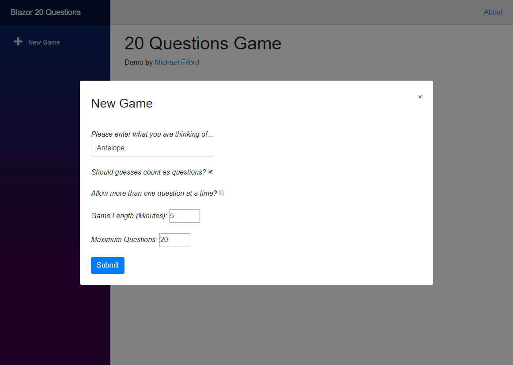
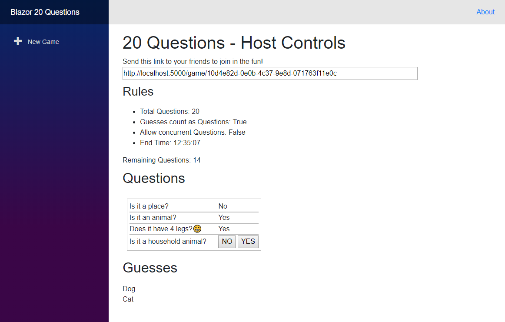
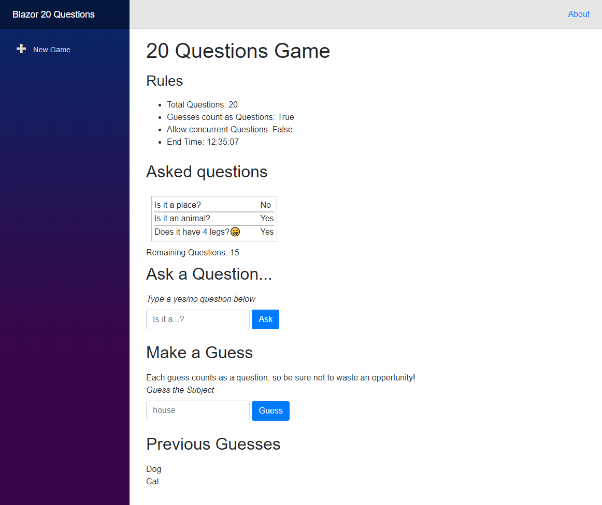

# Blazor 20 Questions

Demo Blazor app implementing a game of [20 Questions](https://en.wikipedia.org/wiki/Twenty_Questions).

Requires .NET Core 3.0 preview 5.

**Stack:**
 - Blazor
 - ASP.NET Core
 - SignalR
 - MongoDB
 - Docker

## Getting Started

The application can be built using `docker-compose`.
Once running, the blazor app can be connected to on port 5000.

This also includes a [mongo-express](http://mongodb-tools.com/tool/mongo-express/) server for debugging.

## TODO

- [x] Websocket update comms
- [x] Show previous guesses
- [ ] Remind the host of their Subject (requires cookie)
- [x] Show local times
- [ ] Add countdown timer for added suspense!
- [ ] Improve CSS

## Screenshots

